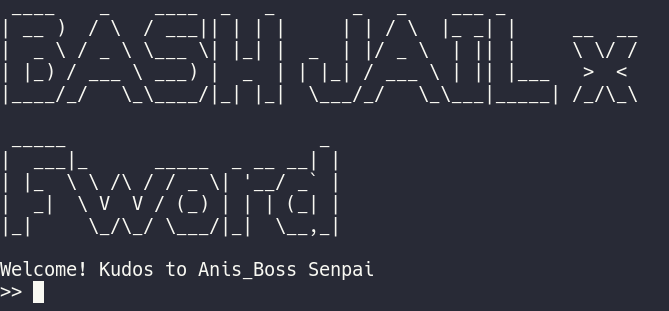
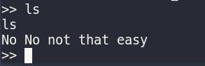
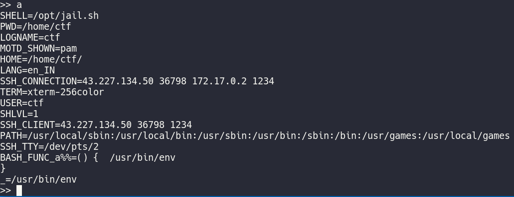
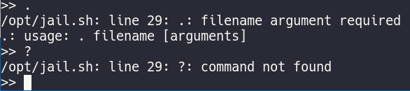
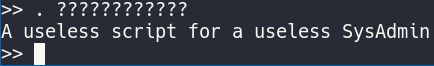
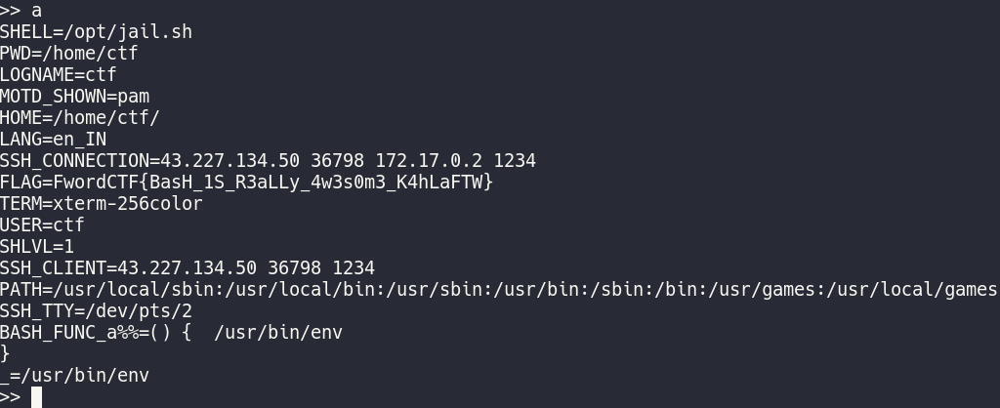

### Jailboss
###### Description: Fwordtask.sh is in the same directory as you. Maybe it will help you.

---
In this challenge, we had to SSH into a box that had a very restrictive shell. We had to make use of that and get the flag.

The first thing I saw after SSHing in was this:



Interesting prompt. Commands such as `ls` don't work, obviously:



I tried all alphanumeric characters **one by one**:

`abcdefghijklmnopqrstuvwxyzABCDEFGHIJKLMNOPQRSTUVWXYZ0123456789`

Only `a` gave any output. It outputted the environment variables:



Next, I checked special characters. I found that only `.` and `?` yield any results:



Now, `.` is the source operator, which means that it executes any script in the context of the present shell. `?`is a wildcard character that represents exactly 1 character. So if you have a file named myfile.txt and you do `cat myfile.???`, it will cat your txt file. 

The description says that `Fwordtask.sh` is in the same directory. This means that running the following command should source that script:

```bash
. ????????????
```
Notice that `?` is repeated exactly 12 times, like the characters in the filename `Fwordtask.sh`

Running this command gave me the following output:



But is it really useless? Let's look at the environment variables again:



We have the flag!

**FwordCTF{BasH_1S_R3aLLy_4w3s0m3_K4hLaFTW}**

**So what happened here?** 
Well, the script exported the environment variable FLAG. Since we sourced that script, we now have that environment variable in our current shell. This gave us the flag.
