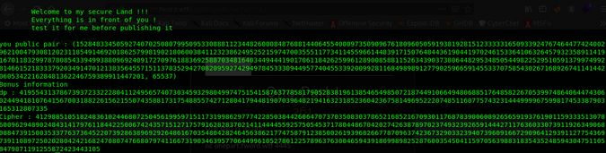

# One Part!

So we had to make a connection to their server through **netcat** to get the cipher!

So after looking at it for long I realized that it is kind of some **RSA Encryption-Decryption**

Hence I started looking for some possible **loopholes** of **RSA Encryption** I came across various attacks which were possible on RSA!

Hence I came across [Weiner's attack](https://en.wikipedia.org/wiki/Wiener%27s_attack), after reading for a while I realized that the parameters which were given to us can be used to exploit the weakness of **RSA**

Rather than writing script for this...I did some more research and came across this [site](https://hgarrereyn.gitbooks.io/th3g3ntl3man-ctf-writeups/content/2017/picoCTF_2017/problems/cryptography/weirderRSA/weirderRSA.html) which had the same Crypto CTF challenge and had the script to decrypt it! hehe!!

**FwordCTF{i_knew_it_its_not_secure_as_i_thought}**
