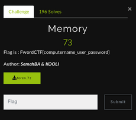
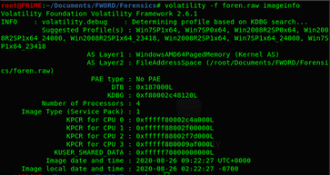
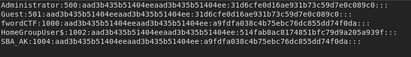
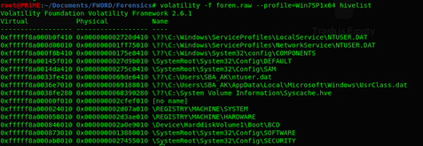
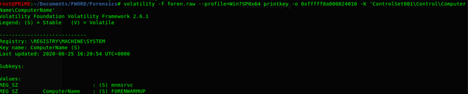

# Memory

**THIS WAS A CLASSIC FORENSIC CHALLENGE!**

**NOTE: THIS WAS A SERIES OF FORENSIC CHALLENGES BASED ON SAME DISK IMAGE** We are sorry we can't provide you the challenge file as its zip file size also exceeds 25MB!

So we need to find the <HOSTNAME><USER><PASSWORD>! So lets start analysing the disk image with **volatility**

Next we need to select suitable profile to perform various operations on the disk image! 
We can find the <USER> and <PASSWORD> through **hashdump** plugin of volatility! On dumping we got this:
  
  

You can try cracking this NTLM hashes using **JTR** or **HASHCAT** using **rockyou wordlist** or [CrackStation](https://crackstation.net/)
So we got the <USER>: **SB_AK** and <PASSWORD>:**password123**
  
 Now we have to find the computer name. There are 2 approaches for finding the Computer Name, the second approach I discovered after the CTF got over !
 
 ** 1st Approach**
 
 After researching some time we got to know that we can find it through registry keys! So first dump the registry keys using **hivelist** plugin!
 
 
 
 We can find the computer name through this registry: **\REGISTRY\MACHINE\SYSTEM** so the next command to dump this particular registry is:
 
 **volatility -f foren.raw --profile=Win7SP0x64 printkey -o 0xfffff8a000024010 -K 'ControlSet001\Control\ComputerName\ComputerName'**

So the Flag is:

**FwordCTF{FORENWARMUP_SB_AK_password123}**

**2nd Approach**

This was much simplier than the first..but we should know the basics right?

If anyone have ever noticed how the computername is stored in Windows OS , I mean the format like : **ComputerName/COMPUTERNAME: " "**
So we can use **strings** on that disk image and **grep** the format so we could have obtained the computer name this way too.
 
 
 
 
 
 

