### Identity Fraud
###### Description: Someone stole our logo and created a team named "Eword". In order to find him, I created a fake twitter account (@1337bloggs) to join Eword team. 
###### Fortunately, they replied to the fake account and gave me a task to solve. So, if I solve it, they will accept me as a team member. 
###### ... Can you help me in solving the task?

---
Let's start off by looking at the Twitter account for @1337bloggs.  Looking at the "Tweets and Replies" section, we see his conversation with Eword team:

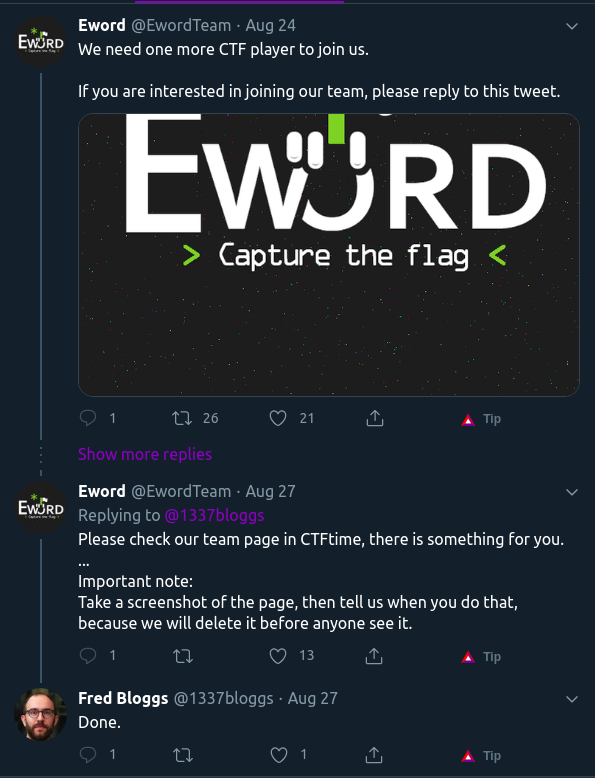

They say that they left something for him at the team's ctftime page. But since he already saw it, they've deleted it. (But have they?)

Let's find Eword team's ctftime page first. Not hard since they have it linked in their Twitter profile description:

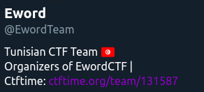

They have indeed deleted whatever was on their team page:

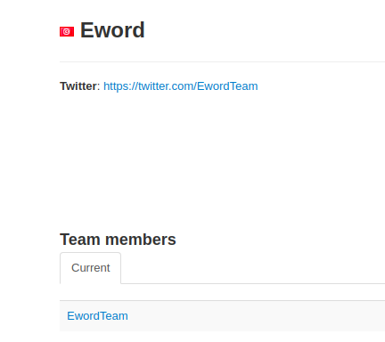

HOWEVER! I could still find it using the [Wayback Machine](https://web.archive.org "Wayback Machine"). It tells me that the team page was saved 2 times. Once at 26th Aug and again at 27th Aug.

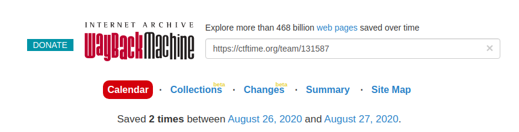

Let's take a look at 26th Aug:

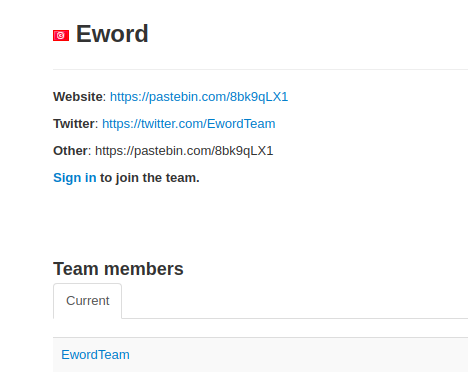

Voila! I got a [pastebin link](https://pastebin.com/8bk9qLX1 "pastebin link") which gave me the following information:

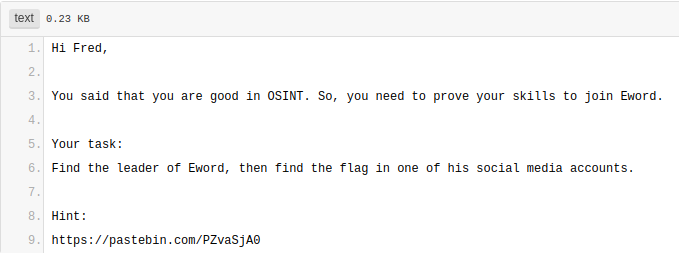

and another [pastebin link](https://pastebin.com/PZvaSjA0 "pastebin link") as a hint. Looking at the hint, I saw some Base64 encoded data:

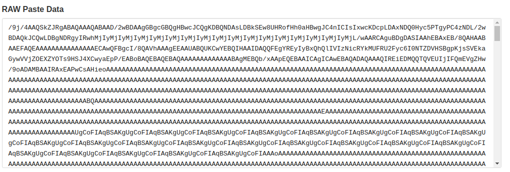

I went over to [Cyberchef](https://gchq.github.io/CyberChef/ "Cyberchef") and decoded it. 

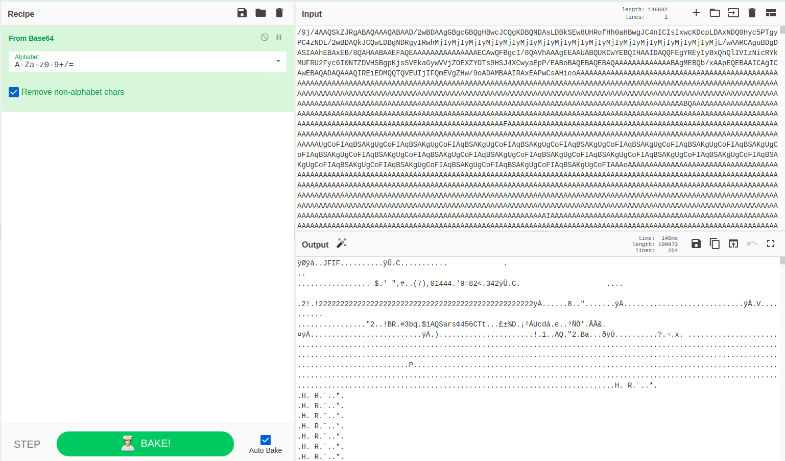

At first it looks unreadable, but if we further convert it to hex, and look at the first few bytes (magic bytes). we see the bytes `ff d8 ff e0 00`. Looking this up tells us that it's an image file.

So I just saved the Base64 data to a file and ran

```bash
cat file.txt | base64 -d > image.jpeg
```

and I had the hint in the form of the following image:

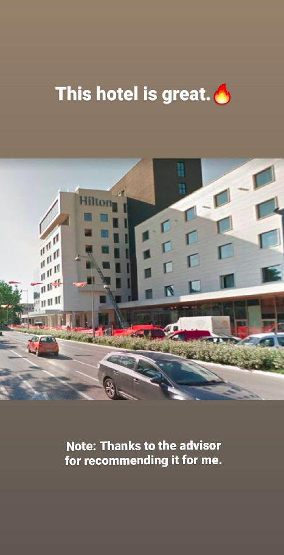

The file dimensions make it obvious that it's a smartphone screenshot of an Instagram Story or Highlight.
Looking up the keywords we have so far, "Eword" and "Hilton", we get the following TripAdvisor link on Google:


which leads to the following review:

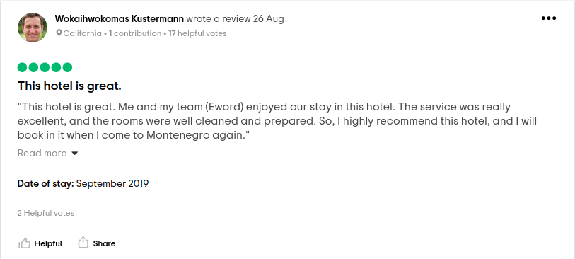

Looks like it's the Captain of Eword team. Looking at his TripAdvisor profile, we see `@check_my_instagram` and what looks like his Instagram username in the profile description, `wokaihwokomaskustermann`. 

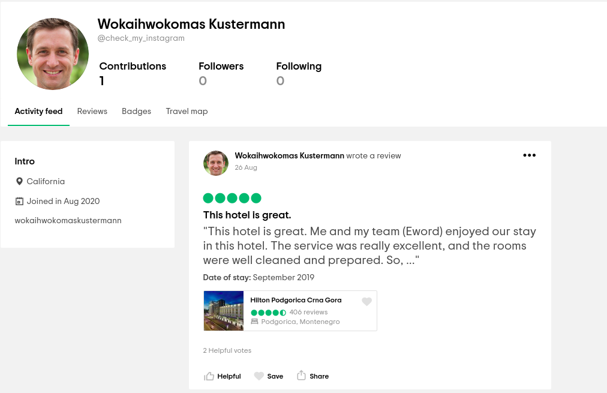

So I just went to `https://instagram.com/wokaihwokomaskustermann` which brought me to his Instagram page.

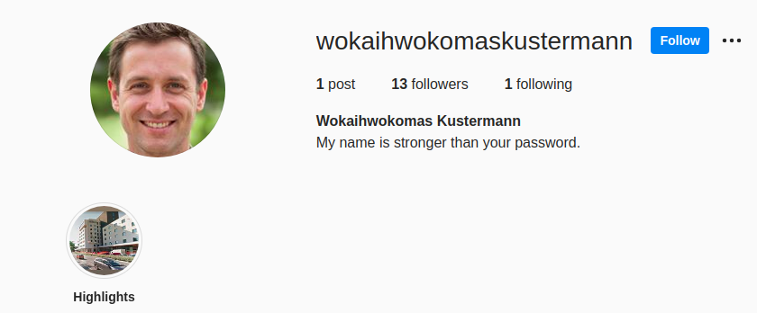

Looks like he also has some highlights! Let's take a look:

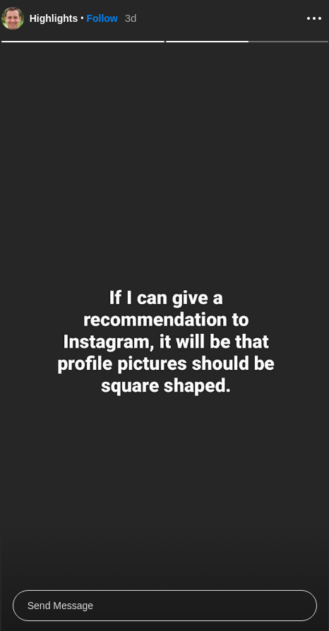

Why would he want square profile pictures? Let's take a look at his full profile pic by going to one of those websites that show you the full size profile picture of a person. One of them is [fullinstadp](https://fullinstadp.com/ "fullinstadp"). Pasting his username in the searchbox we get his full pfp and the flag!


**Eword{c0ngraAatulationZzZz_aNd_w3lCom3_to_Eword_Team_!}**

(That flag was hard to type and I hate it.)
