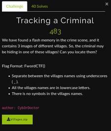

# Tracking a Criminal

**This OSINT challenge was tiresome and a bit difficult one..as you figure it out by looking at the total number of solves**

We were given a zip file which contained three images of different villages.You can find the **ZIP** file [here](./Images/Villages.zip)

We need to find the name of villages!! So when we opened the images it was just the images of villages..**No hints** at all!!

So we looked for some metadata to begin our search..but nothing useful there too! Okay lets begin our campaign with **Reverse Image Search**

We tried **Google Reverse Image Search** and **Yandex** for the first village but we didn't find anything...really **NOTHING** at all! :(

Okay we tried the same methodology for the second image!This time we got many similar images with location but we can't confirm that it is the exact location we were looking for as it were **SIMILAR BUT NOT SAME/EXACT** again a **FAILED ATTEMPT**

Now we started our search with the third image..this time we got some hope about the third village location! The **Google and Yandex** reverse image search pointed the third image to be **Blue City Of Morocco** which is known as **Chefchaouen** We searched about the village **Chefchaouen** we got many similar images more tending to be the same.

Okay now we are left with the first two images.So we started searching for the village through **Google** more specifically through **GOOGLE LENS** and after going through some searches we came across a **BLOG** which had the same image with location **Monsanto village in Portugal** 

After getting success with the **GOOGLE LENS** there's no way to switch the methodology for the first image!! LOL! So we began our final hunt..we searched through many posts but didn't got the results we expected! During this hunt we were trying all the options of **GOOGLE LENS** we got to know about one option in which we can upload the image with some **cropping** so we tried that!! After going through some searches we came across a image which looked same but it was from different angle!! Finally we got the village : **Llanfairpwllgwyngyll in Wales** pretty weird village name! Anyways we got our flag!!

**FwordCTF{llanfairpwllgwyngyll_monsanto_chefchaouen}**
