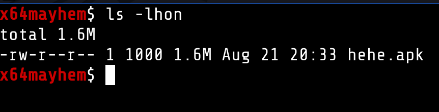
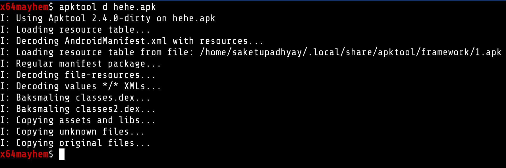
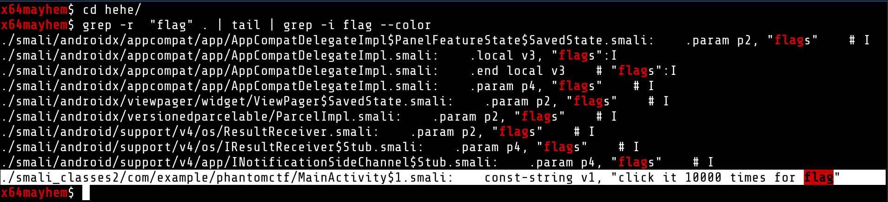
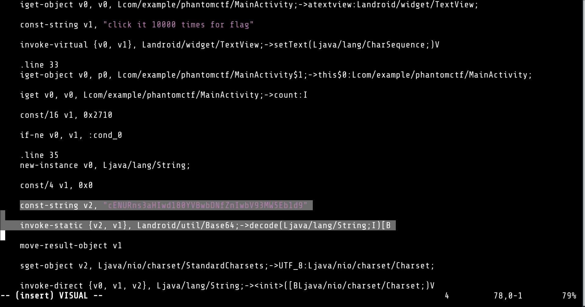
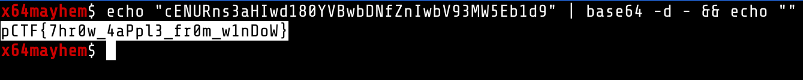

# hehe.apk (Android)

This was one of the baby android challenges. We can solve this in just 5 min.

### Step 1
We get an APK file in the challenge zip.

### Step 2 
Decompile the apk with apktool

###  Step 3
This can vary depending on the challenge, but we just searched for any string matching "flag" and got interesting results

### Step 4

After quick analysis of the [SMALI](https://stackoverflow.com/questions/30837450/what-is-smali-code-android) file we can see that the app is using base64 on a hardcoded string we can try to just decode it

### Step 5 

Searching for the string in the file and then decoding it, gave us the flag.

**pCTF{7hr0w_4aPpl3_fr0m_w1nDoW}**
