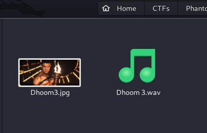
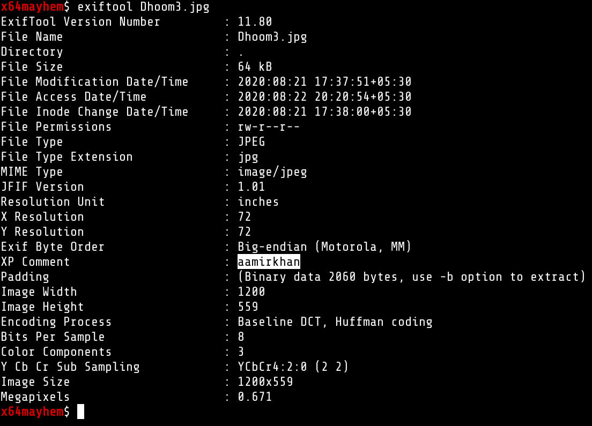
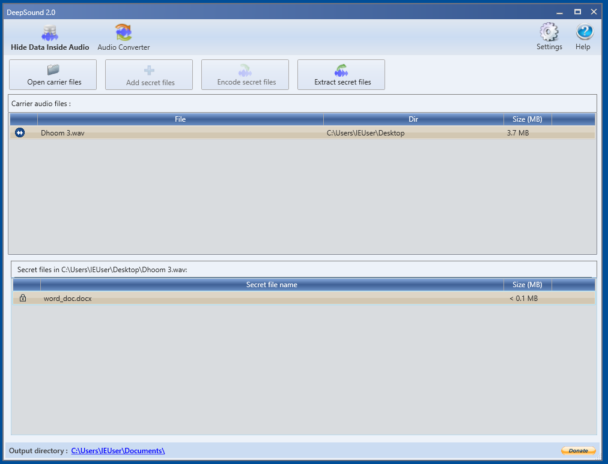
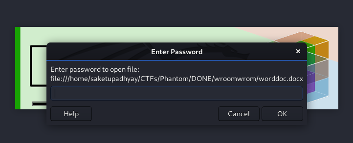
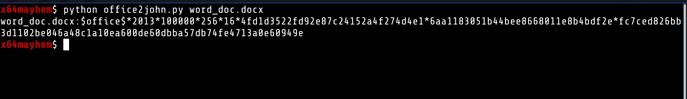

# wroom wroooom (Forensics)

We get 2 files in this challenge.

one is JPEG and other is WAV

### STEP 1.
So first thing I do in case of image is check EXIF info.

Here we got the following 

notice : **XP Comment : aamirkhan**

### STEP 2.

After playing aroud a bit with image I took the WAV file and put it through DeepSound in my windows VM.
Here we get a new file : **word_doc.docx** but it was password protected.

here i just tried the above _XP COMMENT_ and it worked !

### STEP 3:

The word file we got was also password protected, so we extracted the hash using office2john and cracked the password with `john`

password : superstar

### FLAG 
the contents of the file are not visible as they are white in color just `Ctrl+A` and copy and paste in notepad or change color.

