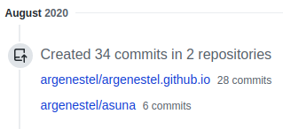
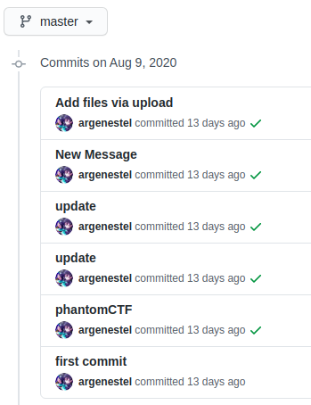
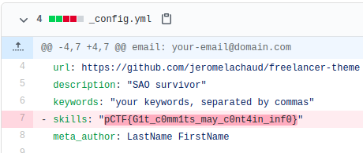

### Asuna
###### Description: I made a website for asuna but something went wrong so you can check and suggest changes. OSINT and Misc challenge. Find her website
###### Author: Argenestel

---
We know that the author of the challenge is Argenestel. Let's check out his GitHub. We can find it easily since he's one of the contributers in the [Cybsec organization GitHub page](https://github.com/CybSec-NITW/ "Cybsec organization GitHub page"). We can also just Google his name since it's a pretty unique username.
Anyway, we find [his GitHub page](https://github.com/argenestel "his GitHub page") and we can see that he's recently contributed to a repository named "asuna".

Going to [the commits page of the repository](https://github.com/argenestel/asuna/commits "the commits page of the repository"), we see the following commits-

The fourth commit in this list, titled "update" has the flag-

**pCTF{G1t_c0mm1ts_may_c0nt4in_inf0}**
