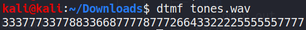

### Dance Monkey
###### Description: TONES & I's new song is taking over the world . Its so cool . Note: Please enclose the flag in pCTF{} format and in upper case only

---
In this challenge we're given an audio file named `tones.wav`. On listening to the file, we can notice that it's full of beeps and boops. Sounds like [DTMF tones](https://en.wikipedia.org/wiki/Dual-tone_multi-frequency_signaling "DTMF tones").

We can use a [DTMF decoder](https://github.com/ribt/dtmf-decoder/ "DTMF decoder") to extract information from this audio file using this one command-

```
dtmf tones.wav
```
which gives us the following output-



These are inputs for one of those old keypads on phones like the older Nokia phones.


Let's split the inputs to make them more meaningful-
```
333-777-33-77-88-33-66-8-777-7-8-777-2-66-4-33-222-2-555-555-777-7
```

Referring to the keypad, the output for this would be- `FREQUENTSTRANGECALLS`
And that's the flag!

**pCTF{FREQUENTSTRANGECALLS}**

