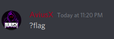
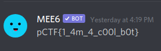

### This cord
###### Description: This chord has a bot

---
If you think about the description a little bit (never overcomplicate things though) you'll notice that the description sounds like- 
> "Discord has a bot"

So heading over the Cybsec's Discord server, we find that they have 2 bots in there. One is MEE6 and the other is Dyno
Dyno has the prefix`?` and MEE6 has the prefix `!`.
Let's try asking Dyno for the flag-

Nothing. Now let's try asking MEE6 instead. If you send the message `!flag` in the server, MEE6 DMs you this-

And we have the flag-

**pCTF{1_4m_4_c00l_b0t}**

Thank you MEE6. Very cool.
