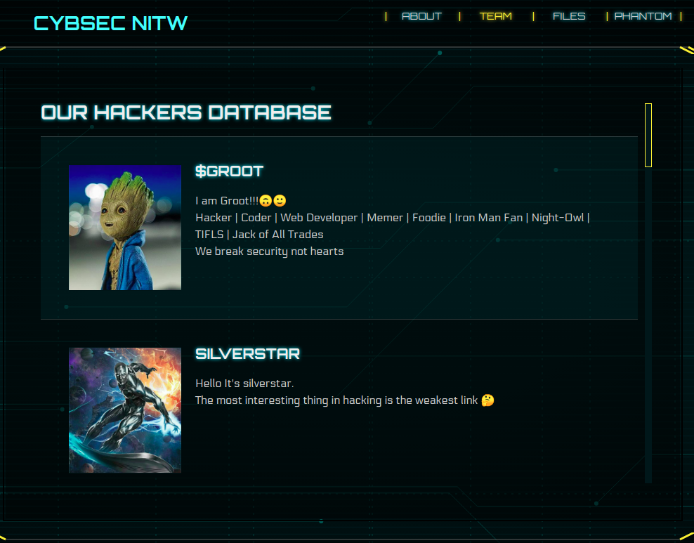

### $root
###### Description: $root of cybsec is so popular that you can find him easily everywhere. And it's really tough for him to hide his flag.

---
If we go to [Cybsec's team page](https://www.cybsec.in/team "Cybsec's team page"), we'll see $root first on the list. Clicking on his name will take us to [his website](https://aakash-kumar.me/ "his website").

Looking around a little bit, we find the [about page of his website](https://aakash-kumar.me/about "about page of his website").

And there it is! We have the flag.
**pCTF{1_4m_r00t}**
