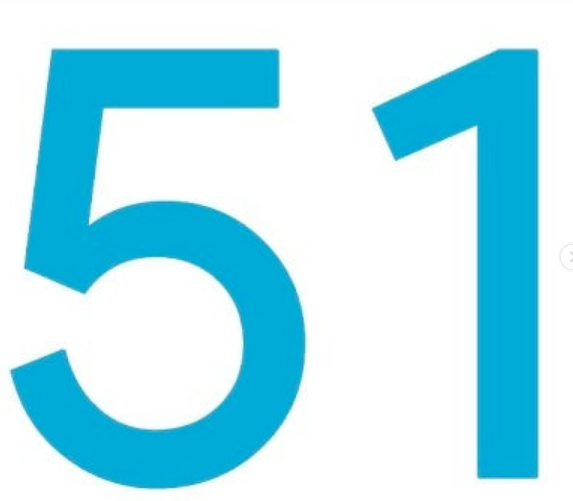
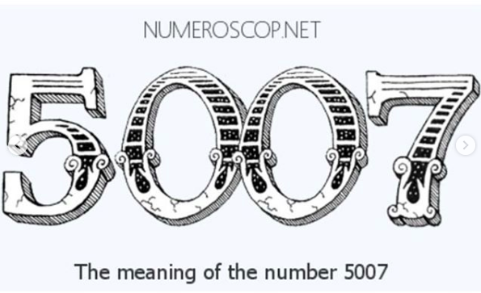
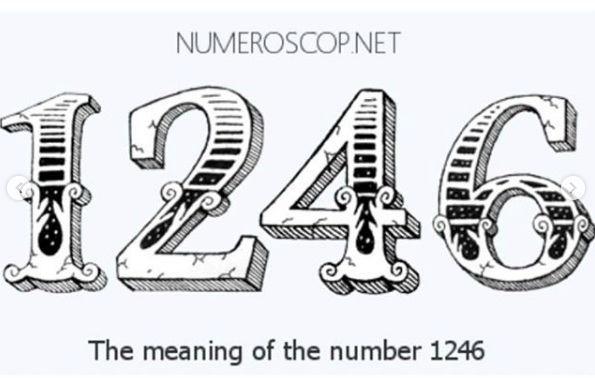
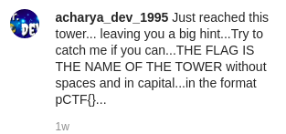

### AcharyaDev
###### Description: Acharya Dev, a 25 year old hacker, suspected to be the main culprit in many illegal activities left a big clue to find where he was in social media, That may lead us to him. NOTE:There are 3 level.the final flag you get needs to be submitted P.S. Enclose the flag in pCTF{} and use capital letters for the answer you get.

---
Starting off, the description of the challenge suggests that we should start by searching for Acharya Dev, a hacker, on social media. The name is not that unique so a Google search didn't yield good results for us. We decided to check each social media site individually. 

Starting off with Instagram, we search for "Acharya Dev" and came across [this particular account](https://www.instagram.com/acharya_dev_1995/ "this particular account").

He has one post with the following images containing numbers and the picture of a globe.

He also has a post caption that says that the post is a clue. He also talks about a tower and says that the name of the tower is the flag.

All hints, from the numbers to the picture of the globe and him talking about a location (in this case, the tower) indicate towards the fact that the numbers are coordinates. And sure enough, Googling the numbers gives us the coordinates-

`51.5007° n 0.1246° w`

Looking these coordinates up gives us a location on the map that is labelled "Big Ben". Big Ben is a clocktower in London. So we have the flag-

**pCTF{BIGBEN}**
