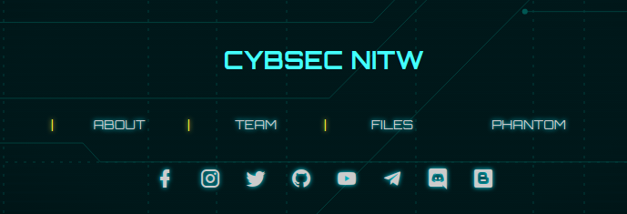
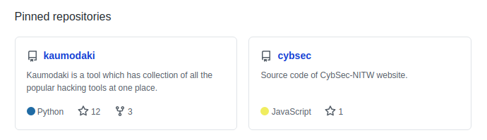
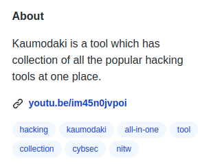
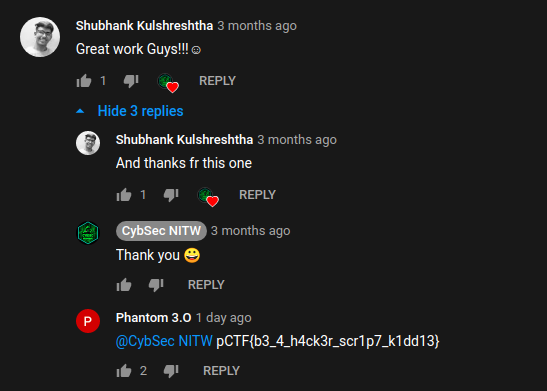

### Toolkit
###### Description: Kaumodaki is very popular. It has some great reviews! Watch it once.

---
A quick Google search for "Kaumodaki" gets us... way too much information and nothing seemingly relevant to the challenge. Let's reduce our scope, shall we? Let's look for things relevant to the team hosting the CTF, Cybsec.

Heading over to [their website](https://www.cybsec.in/ "their website"), we get links for all their social media pages, their GitHub, their Discord and their blog.

I went through all their social media pages and found nothing of relevance. Heading over to GitHub, however, we find this-

Apparently it's an all-in-one tookit they developed by merging a bunch of well known tools. The description of the repository has a YouTube link for a video they made showcasing their tookit. The description of the challenge says "Watch it once." So this was interesting.

The vide itself has nothing related to the flag. After all, it was published many months before the CTF. Nothing in the description either. Looking over to the comments, however, we find this-

And voila! We have the flag.

**pCTF{b3_4_h4ck3r_scr1p7_k1dd13}**
