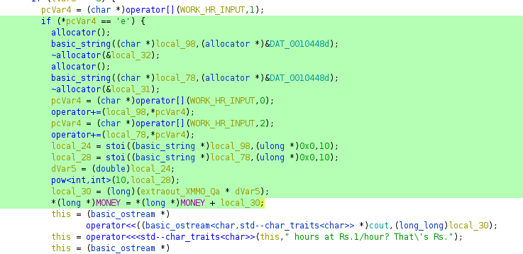
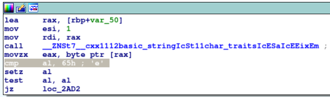
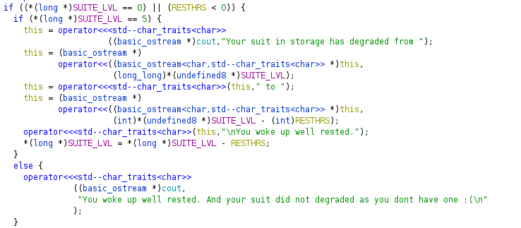
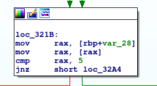
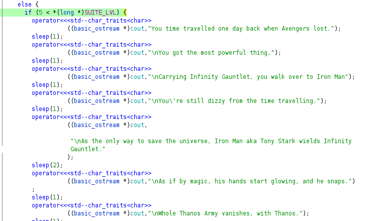
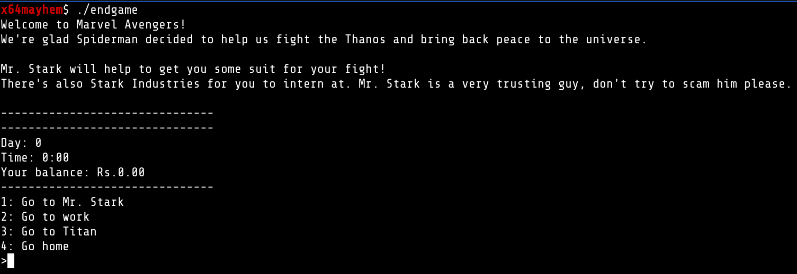
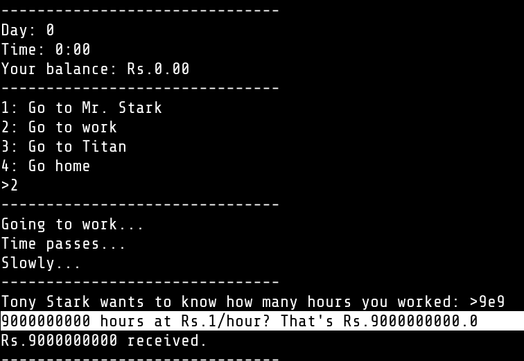
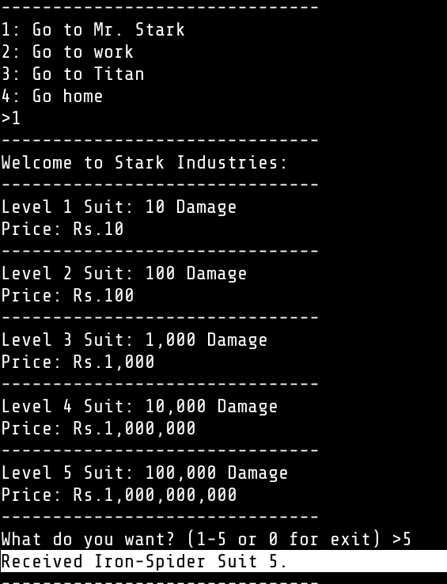
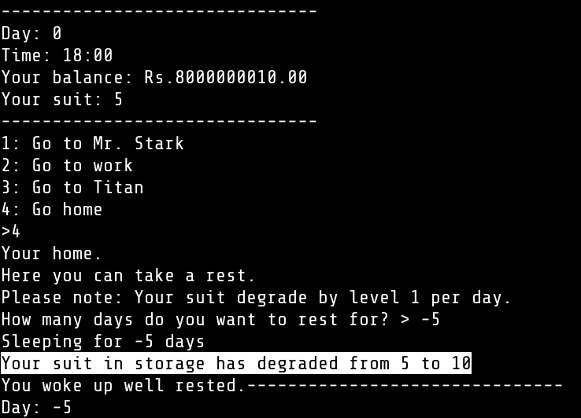
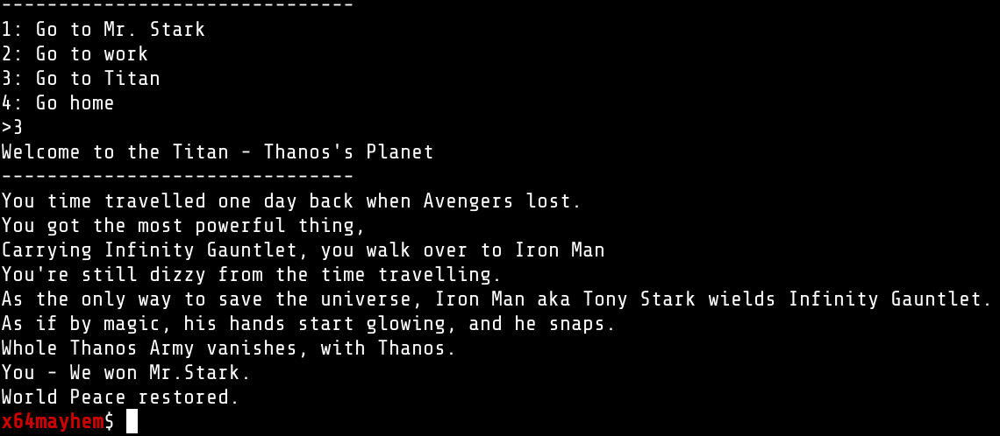

# We are in Endgame now (PWN)

To be honest this also includes small ammount of reverse engineering to find the logic of the program, as this whole challenge is about `Logic Overtake` so we need to win the game by using it's own logic.

I would say this is easy in both domain (reverse and pwn) but together it might fall in medium difficulty level.

#### What we get

We get a `Executable File` named `endgame`. Here are the details : 

```sh
endgame: ELF 64-bit LSB shared object, x86-64, version 1 (SYSV), dynamically linked, interpreter /lib64/ld-linux-x86-64.so.2, BuildID[sha1]=b2c19aa34961bd1fc9251652dc2279a61a2c5e85, for GNU/Linux 3.2.0, not stripped
```

### Understanding the Goal
After playing around with the binary we get the following logic :

* We need to work to earn money  
* We need money to buy spidy suite from Mr. Stark (idk why)
* We can only input `3` charters in Work hour field (max : 999)
* We get paid $1 per hour (o\_o)
* Going home will decrease 1 level from our suite
* We need suite level `> 5` to defeat thanos
* In shop only 5 levels are available.

### After some sweet reverse engineering

* The hours only accepts 3 digits but also `e` i.e. `1e9 = 1*10^9` is acceptable





* The home function only does `a-b` AND DO NOT NORMALISE INPUT



* If `suit level > 5` we win






### How to win

* I put `9e9` in the hours input that gave me `9*10^9`$ (be rich just like that)
* Bought Level 5 Suit
* Went home to rest for `-5` hours, that will change suite level to `5-(-5) = 10` 

So executing this will give us enough money to buy lvl5 armor and then we can `degrade it to lvl 10` lmao and then defeat thanos (if that was this easy) 

Here are Screen Shots for MCU to learn.

 






### FLAG

After this we got our flag (when we executed this in challenge server).


