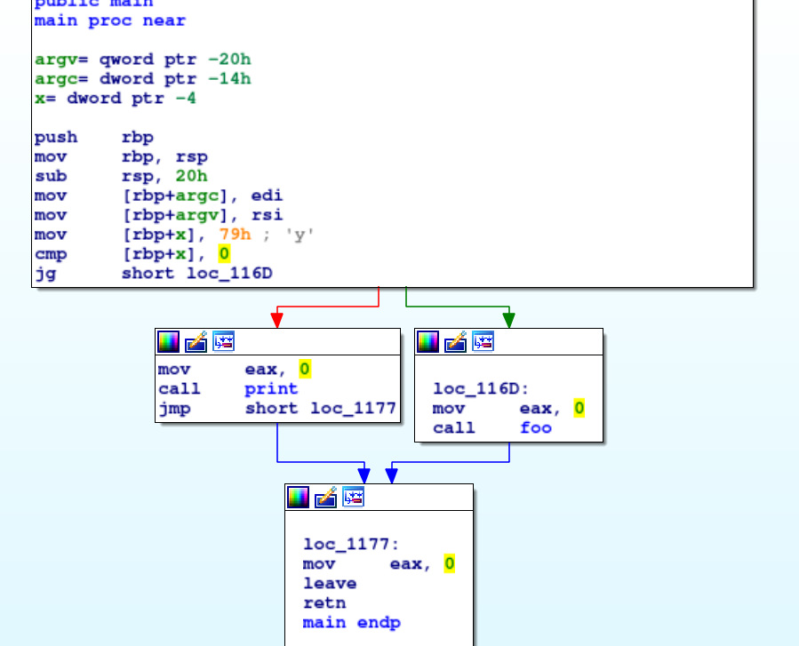
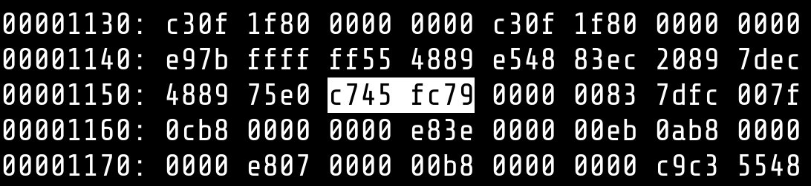
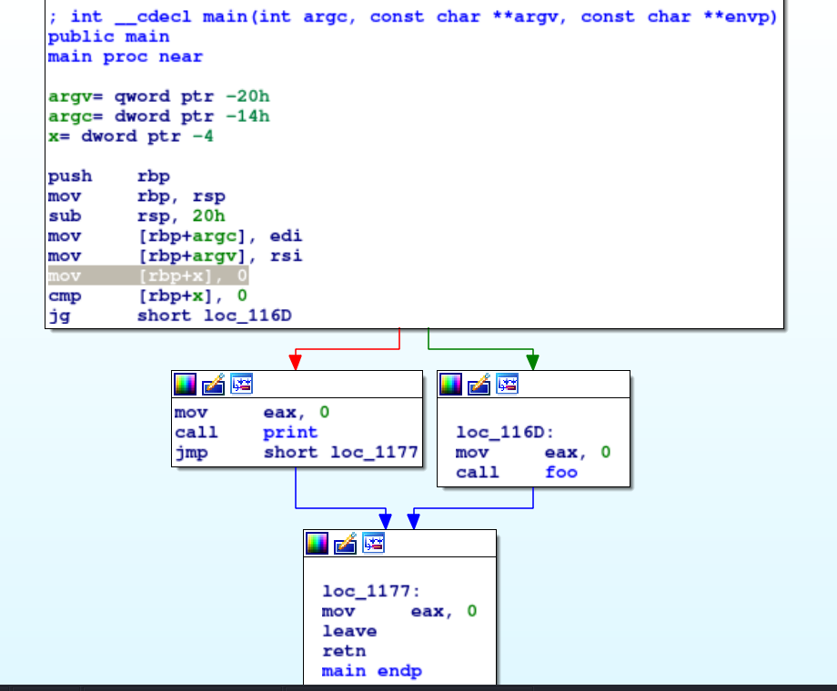
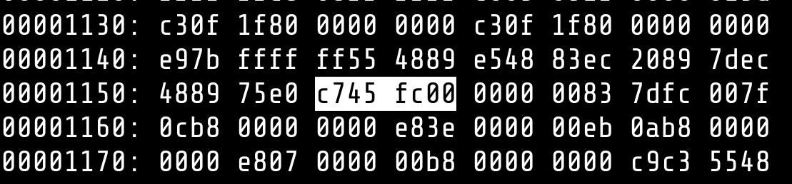
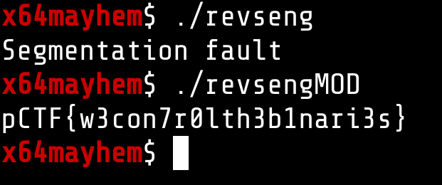

# Segmentation Fault [Reverse]

In this we get a :
```
ELF 64-bit LSB shared object, x86-64, version 1 (SYSV), dynamically linked, interpreter /lib64/ld-linux-x86-64.so.2, BuildID[sha1]=89d54c514d9f6bec697e52edfee4a495266b3577, for GNU/Linux 3.2.0, with debug_info, not stripped
```

and when running the binary we get a segmentation fault. which on anaysis seems to be caused by `foo()` function.

And this was really easy for me, as i like binary patching and this just needed `2 clean patches` either in `JE` and `JNE` instructions or the imm. value of `MOV` opcode.
Let's see the CG of the binary :

### BEFORE MOD






### AFTER MOD [vim <3 xxd]




### FLAG
And running the binary after that gave us the flag, just like that. 



