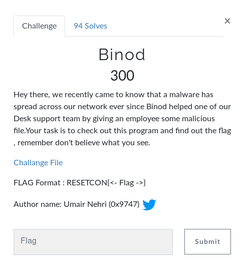
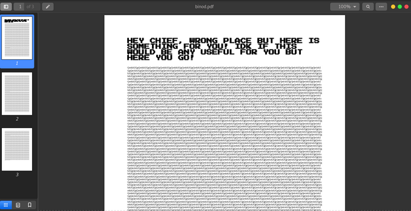

# Binod

We were given a pcapng file which you can find it [here](./Images/logs.pcapng)

So as per the descrption of the challenge we need to look for some malicious program in the Network Packets. So we analsyed the network packets and found the **GET** request for **Binod.exe** 

So we exported the request and the file turned out to be some **PDF file**. So when we opened the pdf file we got something like this:

So we tried decrypting the cipher text from **bas64** but we ended up getting the **same PDF file**.

We were stuck for some time wondering about this challenge!!
Then tried **strings** on that **PDF** we found that there is something like commented **JAVASCRIPT** :**/S /JavaScript
/JS <616C65727428227265736574636F6E7B62316E30645F31245F6330306C5F31246E375F68333F7D22293B0A>**

It seemed to be **HEX code** so we decrypted and finally we got our Flag!!

**resetcon{b1n0d_1$\_c00l_1$n7_h3?}**
