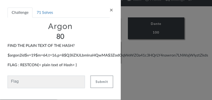

# Argon

So we were given some kind of hash to decrypt... This hash had various different parameters which was pretty new for me!
We need to do some research about the hash,**what's the better place to do research other than GOOGLE? :)**

You can read about this hash [here](https://en.wikipedia.org/wiki/Argon2)

So now we need to decrypt, there's two way to handle it..
1. Write your own script!
2. Research more about pre-existing scripts!

So I preffered to go with the second option..I came across a **GOLANG** script on **StackOverflow** but it didn't helped me much..

After some more research I came across this [Github Repo](https://github.com/CyberKnight00/Argon2_Cracker) which helped us to crack the **Argon2id** hash.

